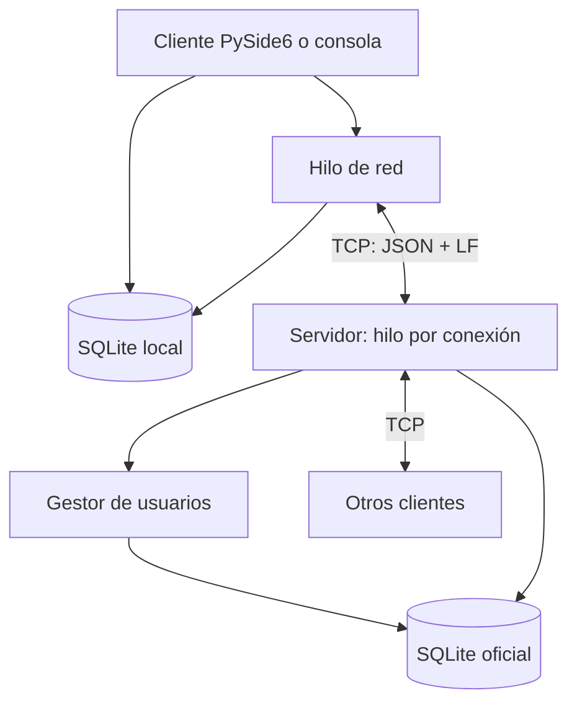

# Arquitectura

## Responsabilidades

`common/protocol.py` comparte límites, fechas y enmarcado entre servidor y cliente.
Los módulos `protocol.py` de cada lado exponen ese contrato sin duplicarlo.
`Reader` conserva bytes incompletos incluso tras un timeout y extrae una trama
cada vez; los saltos de línea dentro de mensajes se escapan al serializar JSON.

El servidor acepta hasta diez conexiones, incluidas las pendientes de LOGIN.
Cada conexión tiene un hilo receptor. Un bloqueo reentrante protege registro,
SQLite, sincronización y publicación, de modo que todos los clientes reciben el
mismo orden. La base usa WAL, claves foráneas y transacciones antes de transmitir.
Las conexiones sin LOGIN tienen timeout de 15 s; después, 30 s. El cliente envía
PING cada 10 s y detecta ausencia de respuestas durante 25 s. Los errores de
protocolo cierran la conexión y liberan el cupo; el cierre actualiza OFFLINE.

`usuarios` contiene UUID único, nombre, IP real del socket, color, fechas y estado.
`mensajes` contiene ID autoincremental, referencia de usuario, contenido y fecha,
además del UUID de envío y una copia de nombre/color al enviar. Así, cambiar el
nombre no modifica la presentación de mensajes antiguos. La restricción única
`(usuario_id, client_message_id)` evita duplicados tras reintentos.

El hilo de red del cliente es el único que escribe en su socket. La GUI comunica
envíos mediante la bandeja SQLite, y el hilo devuelve eventos mediante señales
Qt; todos los widgets se modifican en el hilo gráfico. La base local utiliza su
propio bloqueo para coordinar GUI y red. El UUID y el cursor viven en `metadata`.

## Sincronización sin huecos

1. LOGIN devuelve identidad, color, ID máximo e identidad de la base del servidor.
2. El cliente solicita SYNC con su último ID persistido.
3. El servidor devuelve hasta 40 mensajes en orden. Mientras queden páginas, el
   cliente no recibe publicaciones en directo.
4. En la página final, bajo el mismo bloqueo que publica mensajes, el servidor
   envía la respuesta y activa la recepción en directo. Los mensajes creados
   durante la sincronización entran en otra página o en el flujo en directo.
5. El cliente guarda cada página y el cursor en una transacción SQLite. Después
   de la última página, transmite sus envíos pendientes.
6. MESSAGE se persiste antes de publicarse y confirmarse. Si se corta la conexión
   antes de la confirmación, el siguiente SYNC o reintento reconoce el mismo UUID.

La fuente oficial es siempre SQLite del servidor. Cambiar a otra base de servidor
invalida el cursor y la caché local; cada conversación independiente debería
utilizar un archivo local independiente.
